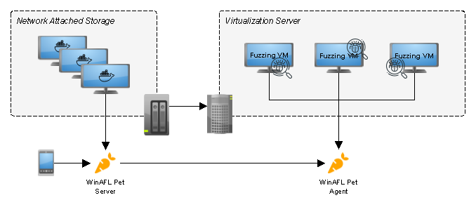
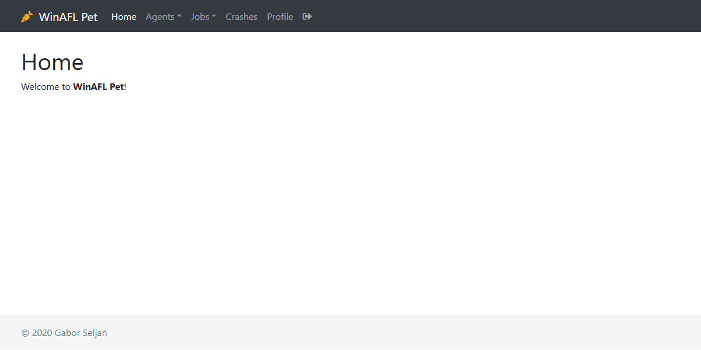

# WinAFL Pet

**WinAFL Pet** is a web user interface dedicated to [WinAFL](https://github.com/googleprojectzero/winafl) remote management via an agent running as a system service on fuzzing machines. The purpose of this project is to allow easy monitoring of fuzzing jobs running on several remote machines. Typical use case is to run the *server* component on a NAS or Raspberry PI and deploy *agents* on a virtualization server as you like. The below figure shows this typical deployment scenario.

## Demo

## Requirements

The following tools must be available on the fuzzing machine. It is recommended to install all the tools in a single directory (e.g. `C:\Tools\...`) for easier management. In general, if WinAFL runs fine manually, should be also fine when run by the agent. In fact, start fuzzing manually and continue with the agent once everything is set up correctly.

+ [WinAFL](https://github.com/googleprojectzero/winafl) for fuzzing
+ [DynamoRIO](https://github.com/googleprojectzero/winafl) for instrumentation
+ [BugID](https://github.com/SkyLined/BugId) for crash analysis
    - [Python 2.7.14](https://www.python.org/downloads/release/python-2714/)
    - [Debugging Tools for Windows](https://docs.microsoft.com/en-us/windows-hardware/drivers/debugger/)

## Deployment

### Server

The server is written in [Go](https://golang.org/) using the [Gin](https://github.com/gin-gonic/gin) web framework and it is running in a minimal [Docker](https://www.docker.com/) image based on [Alpine Linux](https://hub.docker.com/_/alpine). You could use the following command to start a container with persistent data storage:

    > docker run -p 127.0.0.1:4141:4141 \
        -v /path/to/winaflpet/data:/opt/winaflpet/data \
        sgabe/winaflpet

### Agent

The agent is also written in [Go](https://golang.org/) and designed for minimal footprint. Currently it uses the **Windows Credential Vault** to store an automatically generated API key. A service account with *Log on as a service* permission is necessary to retrieve the API key from the vault. See the FAQ for more information. Note down the key as it will be necessary to create a new agent on the management interface.

    > winaflpet-agent.exe --service install
      Username of service account: fuzzy\gabor
      Password of service account: ********
      Secret key of service account: <API_KEY>
    > winaflpet-agent.exe --service start

## Usage

Currently the default user is *admin* with the hostname or Docker container ID as password. Do not forget to change the default password after logging in. Follow the below steps to start fuzzing:

1. Go to the **Agents** page and create a new agent using the previously generated secret key.
2. Go to the **Jobs** page and create a new job associated with the agent created in the previous step.
3. *Start* a fuzzing instance by clicking on the  icon.
4. Be patient until the start request completes (and WinAFL finishes the dry-run).
5. *View* statistics by clicking on the  icon.
6. *Check* running instances by clicking on the  icon.
7. *Collect* crash data by clicking on the  icon.
8. Go to the **Crashes** page to *verify* new crashes by clicking on the  icon.
9. Go to the **Jobs** page and *stop* all fuzzing instances by clicking on the  icon.

### Sample delivery

WinAFL Pet supports delivering samples via shared memory and via a file. You need to make sure that your harness understands the `-f <file name>` argument for file mode and the `-s <shared memory name>` argument for shared memory mode. Note that even if you are using shared memory for fuzzing, your harness must support file mode for analyzing crashes with BugId. The `-f` argument will be automatically passed to the testing harness.

## Environment variables

Some of the configuration options are exposed via environment variables to be used in the container. This allows you to customize WinAFL Pet without creating or modifying configuration files. The below table summarizes the available environment variables and their default settings.

| Variable                             | Default                               |
| -------------------------------------|---------------------------------------|
| `WINAFLPET_DATA`                     | `data`                                |
| `WINAFLPET_HOST`                     | `127.0.0.1`                           |
| `WINAFLPET_PORT`                     | `4141`                                |
| `WINAFLPET_LOG`                      | `winaflpet.log`                       |

## Building WinAFL Pet

You can build the server in a Docker container on Linux:

    make server

Or the service binary for the agent on Windows:

    make agent

## FAQ

### How do I configure a user account to have *Logon as a service* permission?
Perform the following to edit the *Local Security Policy* of the computer where you want to fuzz:

1. Open the **Local Security Policy**.
2. Expand **Local Policies** and click on **User Rights Assignment**.
3. In the right pane, double-click *Log on as a service*.
4. Click on the **Add User or Group...** button to add the new user.
5. In the **Select Users or Groups** dialogue, find the user you wish to enter and click **OK**.
6. Click **OK** in the **Log on as a service Properties** to save changes.

Ensure that the user which you have added above is not listed in the *Deny log on as a service* policy in the **Local Security Policy**.
